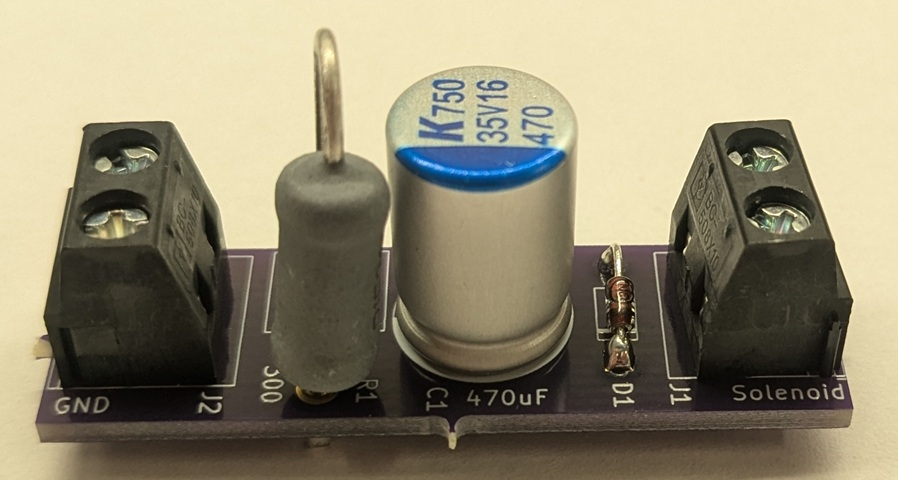

# SolGuard

This boards acts like a [snubber](https://en.wikipedia.org/wiki/Snubber) that prevents collapsing fields
of solenoids from disrupting surrounding electronics.

When using a relay board, such as the [MOD-IO](https://www.olimex.com/Products/Modules/IO/MOD-IO/open-source-hardware),
with a Raspberry Pi we found that switching the valves would periodically break the communication between the Pi
and the board. This is due to the transient currents disrupting surrounding and connected electronics.

This board uses a `RC` circuit plus a `diode` to prevent these sudden transients and to prevent over-voltage on the
power rails.

The diodes and RC components used determine the maximum input voltage supported. The ones below support
solenoids up to `35VDC`.

## Bill of materials

| Quantity | Description                     | DigiKey #                 | MFG          | MFG #              | Alt`*` DigiKey #       |
|----------|---------------------------------|---------------------------|--------------|--------------------|------------------------|
| 1        | SolGuard PCB                    |                           | OSH Park     |                    |                        |
| 2        | TERM BLK 2P SIDE ENT 5.08MM PCB | 277-15491-ND              | PHOENIX CON. | 5452257            | 5430360-ND             |
| 1        | DIODE GEN PURP 100V 500MA DO35  | 1N4149CT-ND               | ONSEMI       | 1N4149TR           | 1N4149CT-ND            |
| 1        | RES 300 OHM 1% 5W AXIAL         | 696-1078-ND               | BE SERVICES  | UB5C-300RF1        | RSC-300RCT-ND          |
| 1        | CAP ALUM POLY 470UF 20% 35V T/H | 399-A750MV477M1VAAE018-ND | KEMET        | A750MV477M1VAAE018 | 10-EEH-AZS1V471BCT-ND  |

The PCB (`SolGuard.kicad_pcb`) was manufactured by OSH Park using their with the following specs:

    0.52 x 1.72 inch (13.3 x 43.8 mm) 2 layer board.

`*`These are DigiKey part numbers for alternate versions of these parts if the main one is not available.

## Build

To build, it's easiest to first solder the two terminals, the diode, the capacitor, and then the resistor.

## Usage

To use, on the solenoid side connect the two leads of the solenoid / valve. Typically, they are not sensitive to
polarity. On the other side, a typical construction is to connect the ground terminal to ground and the other terminal
to the relay's switching terminal.

For the relays terminals, the **normally closed** side is left unconnected, the
**normally open** side is connected to power, and the **switching** terminal to the SolGuard board's power terminal.
Then, by default, the valve is unpowered. But when the relay is ON, the switching terminal and the power side terminal
of the board is connected powering the solenoid.
